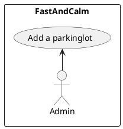

A parking lot or car park is a dedicated cleared area that is intended for parking vehicles. In most countries where cars are a major mode of transportation, parking lots are a feature of every city and suburban area. Shopping malls, sports stadiums, megachurches, and similar venues often feature parking lots over large areas
[Reference](https://github.com/tssovi/grokking-the-object-oriented-design-interview/blob/master/object-oriented-design-case-studies/design-a-parking-lot.md)


> Parking lot is an open area designated for parking cars. We will design a parking lot where a certain number of cars can be parked for a certain amount of time. The parking lot can have multiple floors where each floor carries multiple slots. Each slot can have a single vehicle parked in it.
[Reference](https://medium.com/double-pointer/system-design-interview-parking-lot-system-ff2c58167651)


## Requirements gathering

What are some questions you would ask to gather requirements?
```
```

## Requirements
What will be 10 requirements of the system, according to you?
Do not worry about the correctness of the requirements, just write down whatever comes to your mind.
Your job is not to generate the requirements, but get better at understanding problem statements and anticipating the functionalities your application might need.
```
```

## Design
- Requirement
- Use case
- Class Diagram

## Implementation
- CLI - command
- API
- Controller
- Services
- Repository

## Questions
1. Can a parking lot have multiple floors?
  - yes N slots
2. Each floor will have multiple slots
3. How many types of slots are there
  - 3 Large medium small
4. A vehicle can only park on it's won type of slot
5. Each entrygate have a display board

6. How do we enter?
  - Operator will give you a ticket
7. How do we pay?
  - Calculation
    - Cost is a function of your car type and duration
  - Modes
    - Case
    - Card(Credit/ Debit)
    - Online
  - Payment Counter
    - At every floor
8. Display board
  - Empty slots
9. Allocate
  - Any random empty slots
  - A specific floor


## Use case diagram
are the requirements clear enough to define use case?

### Actors
1. Admin
2. Parking Attendent
3. Customer


### Use case

#### Actor 1

Name of the actor - `Admin`

1. `Create a parking lot`
2. `Create a parking Floor`
3. `Add new Parking spots`
4. `Update status of a parking spot`

#### Actor 2

Name of the actor - `Parking Attendent`

1. `Check Empty Slots`
2. `Issue a ticket`
3. `Collect Payment`
4. `Checkout`

#### Actor 3

Name of the actor - `Customer`

1. `Pay`
2. `Check Status`



